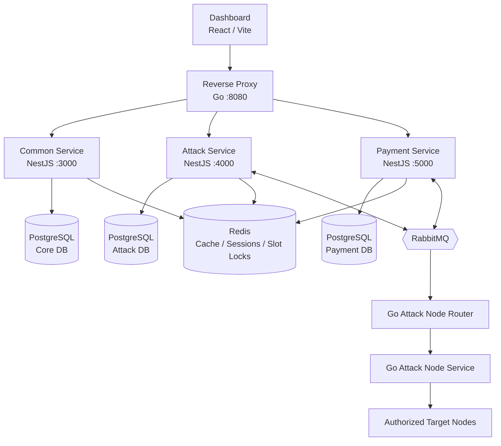
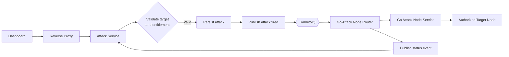
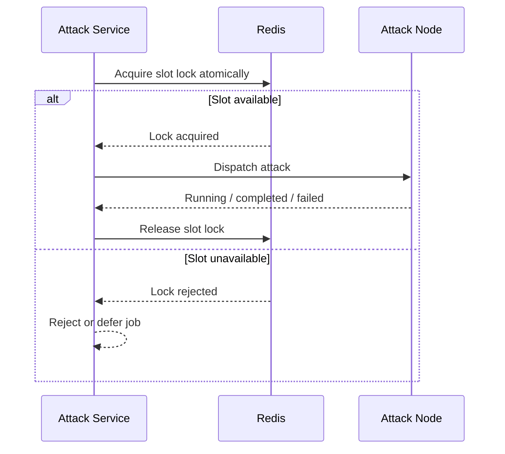
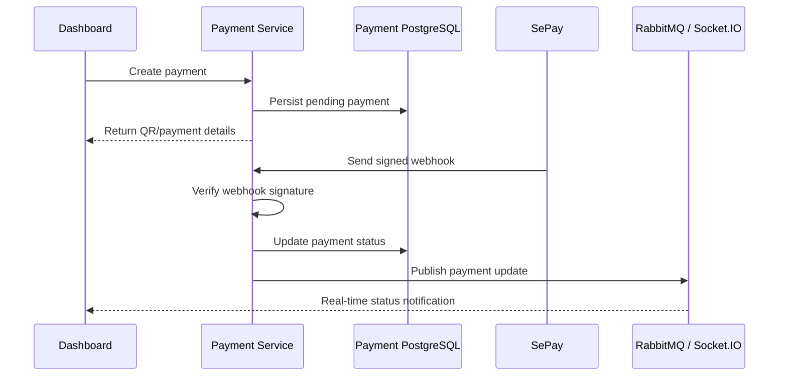

# LoadService

> A distributed platform for authorized load and resilience testing.

LoadService helps teams evaluate the performance and resilience of infrastructure they own or are explicitly authorized to test. It combines a modern operations dashboard, domain-focused NestJS services, a Go reverse proxy, and distributed Go attack-node workers.

## Product preview

<p align="center">
  
  
</p>

<p align="center">
  
  
</p>

<p align="center">
  
  
</p>

## Architecture — Overall platform

### Mermaid architecture diagrams










Redis provides a shared concurrency boundary across API instances and attack workers, preventing two concurrent jobs from claiming the same worker slot.

## Core capabilities

- Ownership-aware load and resilience testing workflows
- Target, network, method, server, duration, and concurrency management
- JWT authentication, Google OAuth, RBAC, permissions, plans, and feature entitlements
- Event-driven attack orchestration through RabbitMQ
- Distributed slot locking to prevent worker-slot conflicts during concurrent jobs
- Real-time attack, payment, and support-ticket updates through Socket.IO
- SePay payment integration and webhook processing
- PostgreSQL persistence with separate core, attack, and payment databases
- Redis-backed caching and session support
- Swagger/OpenAPI documentation for every backend service

## Repository structure

| Directory | Description |
| --- | --- |
| [`dashboard`](dashboard/) | React/Vite administration dashboard |
| [`backend`](backend/) | NestJS Common, Attack, and Payment services |
| [`reverse-proxy`](reverse-proxy/) | Go REST routing layer on port `8080` |
| [`attack-node-router`](attack-node-router/) | Go RabbitMQ consumer and attack-node scheduler |
| [`attack-node-service`](attack-node-service/) | Go worker exposing node health and attack controls |
| [`servers`](servers/) | Supporting server and deployment resources |

## Technology stack

- **Frontend:** React, TypeScript, Vite, TanStack Router, React Query, Tailwind CSS, Radix UI, Socket.IO
- **Backend:** NestJS, TypeScript, Express, Swagger, JWT, Passport, Argon2
- **Data:** PostgreSQL, Drizzle ORM, Redis
- **Messaging:** RabbitMQ and AMQP
- **Infrastructure:** Go, Docker, Docker Compose, Nginx
- **Quality:** ESLint, Prettier, Jest, Vitest, Playwright

## Quick start

### 1. Start backend services

```bash
cd backend
pnpm install
cp .env.example .env
pnpm db:reset
pnpm dev:common
pnpm dev:attack
pnpm dev:payment
```

Run the three `pnpm dev:*` commands in separate terminals. PostgreSQL, Redis, and RabbitMQ must be available first.

### 2. Start the reverse proxy

```bash
cd reverse-proxy
cp .env.example .env
go run .
```

Update `reverse-proxy/config.json` when backend services are not running on localhost.

### 3. Start the dashboard

```bash
cd dashboard
pnpm install
cp .env.example .env
pnpm dev
```

Open `http://localhost:5173`. The default REST proxy endpoint is `http://localhost:8080/api/v1`.

## Docker workflows

The backend can build service images from source:

```bash
cd backend
docker compose up --build -d
```

For production, `backend/docker-compose.prod.yml` pulls the published backend images from Docker Hub:

```bash
docker compose -f docker-compose.prod.yml pull
docker compose -f docker-compose.prod.yml up -d
```

The dashboard and Go services also include component-level Dockerfiles where applicable. Their individual READMEs contain service-specific commands and configuration details.

## Security and responsible use

Load-testing features must only be used against systems you own or are explicitly authorized to test. Protect attack-node ports, RabbitMQ credentials, JWT secrets, OAuth credentials, payment secrets, and SMTP credentials. Keep all `.env` files out of version control and use the corresponding `.env.example` files as safe configuration templates.

## Documentation

- [Backend README](backend/README.md)
- [Dashboard README](dashboard/README.md)
- [Reverse Proxy README](reverse-proxy/README.md)
- [Attack Node Router README](attack-node-router/README.md)
- [Attack Node Service README](attack-node-service/README.md)

## Project status

LoadService is under active development. Interfaces, deployment configuration, and operational workflows may evolve as the platform grows.
