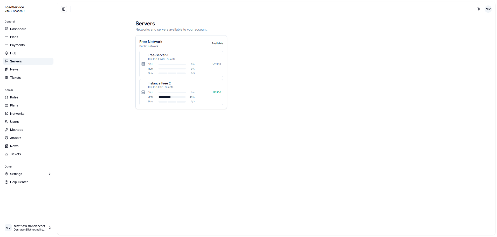
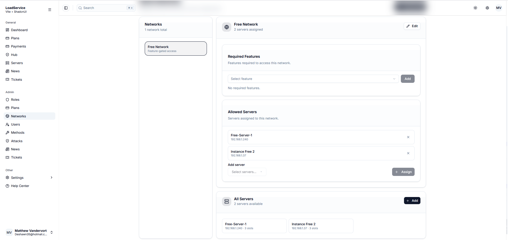
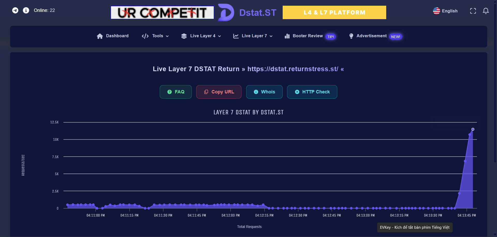
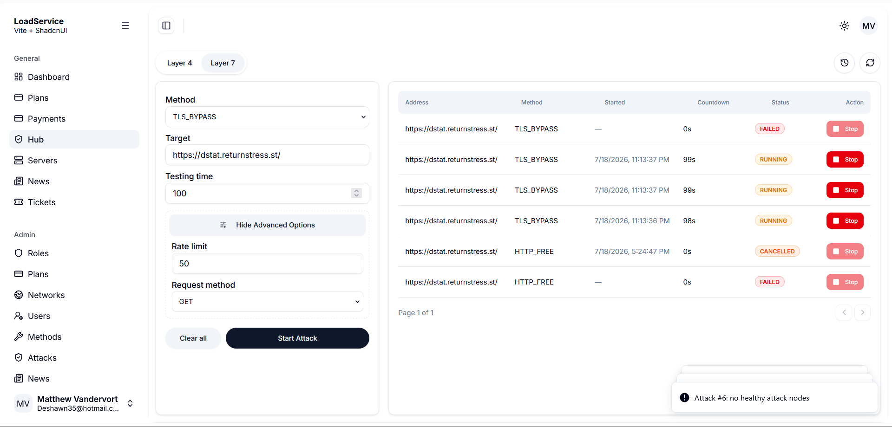
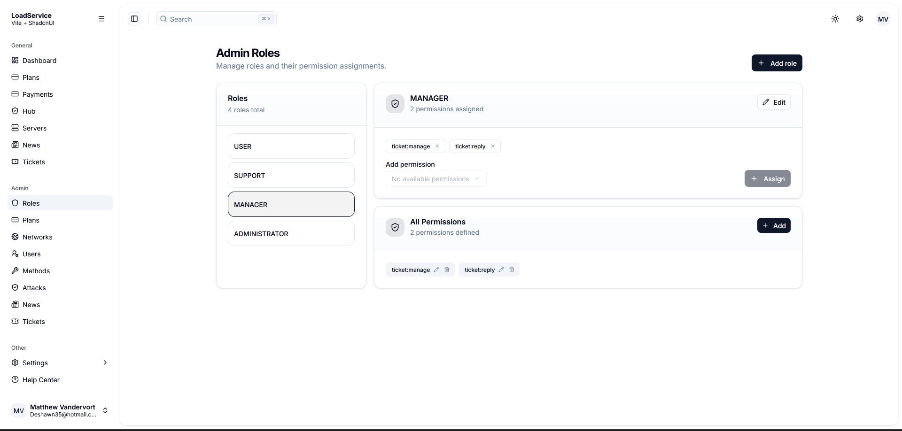
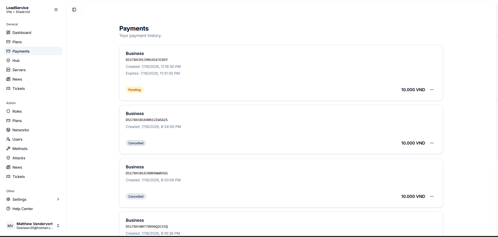
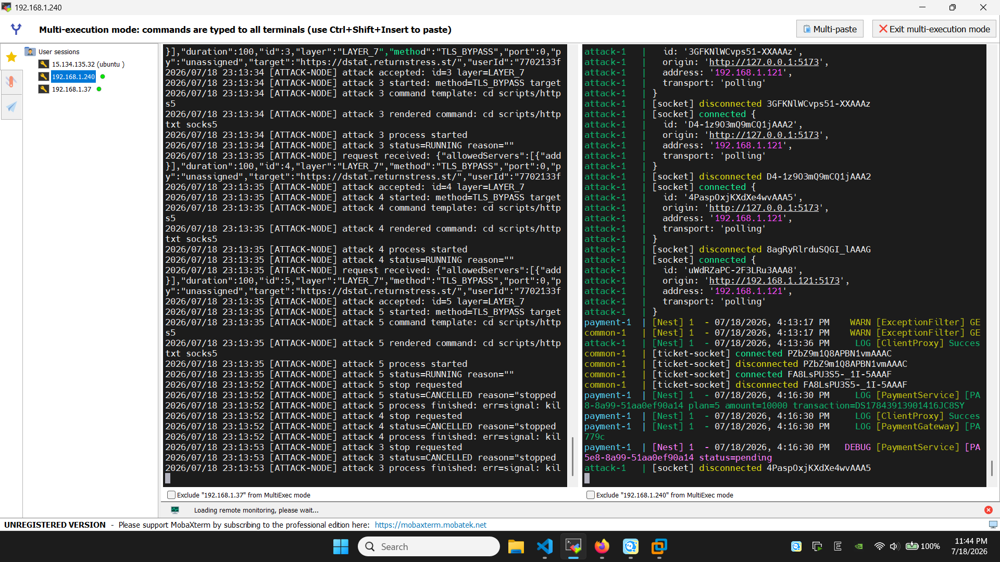
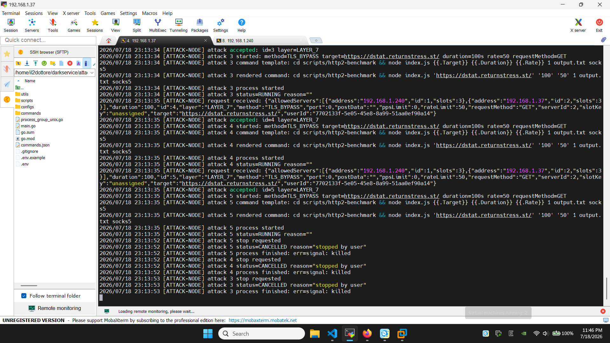
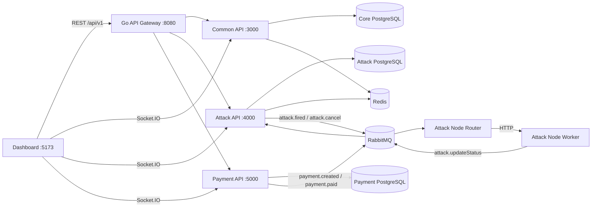

# LoadService

LoadService is a distributed platform for authorized load and resilience testing. It combines a React operations dashboard, three NestJS domain services, a Go REST gateway, a RabbitMQ-based node router, and Go workers that execute configured benchmark commands.

Only run tests against systems you own or are explicitly authorized to test.

## Demo Screenshots

<p align="center">
  
  
</p>

<p align="center">
  
  
</p>

<p align="center">
  
  
</p>

<p align="center">
  
  
</p>

## Project Map

| Directory | Responsibility |
|---|---|
| [`dashboard`](dashboard/) | React/Vite user and administration dashboard |
| [`backend`](backend/) | NestJS monorepo containing Common, Attack, and Payment services |
| [`api-gateway`](api-gateway/) | Go reverse proxy for REST routes under `/api/v1/...` |
| [`attack-node-router`](attack-node-router/) | RabbitMQ consumer that selects a healthy worker and dispatches a benchmark |
| [`attack-node-service`](attack-node-service/) | Go worker that runs allow-listed Layer 4 and Layer 7 command templates |
| [`servers`](servers/) | Docker Compose stack for PostgreSQL, Redis, and RabbitMQ |
| [`images`](images/) | Screenshots used by this README |
| [`dist`](dist/) | Generated TypeScript build metadata; not a standalone service |

## Architecture



The gateway proxies REST traffic only. The dashboard connects directly to the Socket.IO namespaces exposed by the backend services.

## Main Features

- Username/email login, JWT access and refresh tokens, Redis-backed sessions, email verification, password reset, and Google OAuth linking.
- User, role, permission, plan, feature, news, and support-ticket management.
- Layer 4 and Layer 7 benchmark methods with plan duration, concurrency, method-feature, network-feature, and server availability checks.
- RabbitMQ orchestration using `attack.fired`, `attack.cancel`, `attack.updateStatus`, `payment.created`, and `payment.paid` events.
- Worker selection by health and active slot count, cancellation forwarding, and persisted attack status updates.
- Redis attack-slot reservations and short-lived server-health caching.
- SePay/VietQR payment creation, webhook processing, plan assignment, and live payment updates.
- Socket.IO updates for attacks (`/events`), tickets (`/tickets`), and payments (`/payments`).
- Separate PostgreSQL databases for core, attack, and payment data.
- Swagger/OpenAPI UI for each NestJS service.

## Prerequisites

- A Linux host with a Bash-compatible shell. The commands below target Ubuntu/Debian-style development environments.
- Node.js `24` or newer.
- pnpm (Corepack can provide it).
- Go `1.26.5` or a compatible newer version.
- Docker Engine with Docker Compose, or local PostgreSQL 16+, Redis 7+, and RabbitMQ 4+ installations.
- Node.js on attack-worker hosts because the checked-in command templates call JavaScript benchmark scripts.
- Google OAuth, SMTP, and SePay credentials only when those integrations are used.

## Configuration

Each runnable component has its own `.env.example`:

```text
backend/.env.example
dashboard/.env.example
api-gateway/.env.example
attack-node-router/.env.example
attack-node-service/.env.example
```

Copy each required file to `.env`, replace every placeholder, and never commit real credentials.

Important relationships:

- `dashboard/VITE_API_URL` must point to the gateway, normally `http://localhost:8080/api/v1`.
- Dashboard Socket.IO URLs point directly to Common `:3000`, Attack `:4000`, and Payment `:5000`.
- `api-gateway/config.json` must contain upstream URLs reachable from the gateway process.
- `COMMON_SERVICE_URL`, `ATTACK_SERVICE_URL`, and `PAYMENT_SERVICE_URL` are direct service-to-service URLs.
- `RABBITMQ_*_QUEUE` names must match across the backend, router, and worker.
- `attack-node-router/ATTACK_NODE_PORT` must equal `attack-node-service/LISTEN_PORT`.
- Server addresses seeded or created in the Attack service must be reachable from the router.

The example files contain development values only. Review database and RabbitMQ credentials before exposing any service outside a trusted network.

## Run Locally

### 1. Start infrastructure

```bash
cd servers
docker compose up -d
cd ..
```

This starts PostgreSQL on `5432`, Redis on `6379`, RabbitMQ on `5672`, and RabbitMQ Management on `15672`.

### 2. Configure, migrate, and seed the backend

```bash
cd backend
cp .env.example .env
corepack enable
pnpm install
pnpm db:reset
```

`db:reset` is destructive: it drops and recreates the configured core, attack, and payment schemas, then seeds core and attack data. For an existing database, run only the required `pnpm db:migrate*` commands.

### 3. Start the three backend services

Run these commands in separate terminals from `backend`:

```bash
pnpm dev:common
pnpm dev:attack
pnpm dev:payment
```

| Service | REST URL | Swagger | Socket.IO namespace |
|---|---|---|---|
| Common | `http://localhost:3000/api/v1` | `http://localhost:3000/api-docs` | `/tickets` |
| Attack | `http://localhost:4000/api/v1` | `http://localhost:4000/api-docs` | `/events` |
| Payment | `http://localhost:5000/api/v1` | `http://localhost:5000/api-docs` | `/payments` |

### 4. Start the API gateway

Update `api-gateway/config.json` for the three local upstream URLs, then run:

```bash
cd api-gateway
cp .env.example .env
go run .
```

The default external REST base URL is `http://localhost:8080/api/v1`.

### 5. Start an attack node and its router

Make `attack-node-router/ATTACK_NODE_PORT` and `attack-node-service/LISTEN_PORT` identical. Run the worker on the address registered in the Attack database:

```bash
cd attack-node-service
cp .env.example .env
go run .
```

In another terminal:

```bash
cd attack-node-router
cp .env.example .env
go run .
```

The worker's included scripts are intended for a Linux-like runtime. Host metrics use `/proc`, and command execution uses `/bin/sh` on Linux.

### 6. Start the dashboard

```bash
cd dashboard
cp .env.example .env
corepack enable
pnpm install
pnpm dev
```

Open `http://localhost:5173`.

## Demo Data

`pnpm db:seeder:core` creates ten sample users, the `USER`, `SUPPORT`, `MANAGER`, and `ADMINISTRATOR` roles, ticket permissions, five plans, and three feature flags. `pnpm db:seeder:attack` creates four methods, one network, and one server.

The seed source contains password hashes but does not document a shared plaintext demo password. Create a user through `/api/v1/auth/register` or update the seed data for a known local credential.

## Main Flow

1. A signed-in user chooses a plan-compatible method and submits a target, duration, and Layer 4 or Layer 7 options.
2. The Attack service validates plan limits and required features, finds allowed servers, persists the job, and publishes `attack.fired`.
3. The router checks each allowed worker's `/health` response and selects the least busy eligible node.
4. The worker renders an allow-listed command from `commands.json`, starts it in a process group, and publishes status changes.
5. The Attack service persists `RUNNING`, terminal, and failure states, releases a matching Redis slot, and emits `attack.status` to the dashboard.
6. A cancellation publishes `attack.cancel`; the router forwards it to `/attacks/{id}/stop` on the assigned worker.

## Payment And SePay

The dashboard creates a pending payment through `POST /api/v1/payments`. The Payment service validates the selected plan against the Common service and returns a VietQR URL.

Configure SePay to call the Payment service's public callback:

```text
POST http://<payment-host>:5000/payments/sepay-webhook
```

This route is deliberately excluded from the global `/api/v1` prefix. When both a secret and an authorization header are present, the service compares the header's bearer value with the hex HMAC-SHA256 of the JSON payload. A matching transaction is then marked paid, `payment.paid` is published, the plan is assigned through the Common service, and `payment.status` is broadcast.

The current implementation skips the HMAC comparison when either the configured secret or authorization header is absent. Do not expose this callback until authentication is enforced at the application or ingress layer.

## Docker Workflows

The backend Compose file is intended to build all three NestJS images from the current source:

```bash
cd backend
docker compose up --build -d
```

The Dockerfile receives a `SERVICE` build argument and runs `node dev-scripts/build.js ${SERVICE}`, the same helper used by local Linux builds.

Run the published backend images:

```bash
cd backend
docker compose -f docker-compose.prod.yml pull
docker compose -f docker-compose.prod.yml up -d
```

Run the published Go gateway and router images from the repository root:

```bash
docker compose -f docker-compose.go.yml up -d
```

The dashboard and API gateway have Dockerfiles. The attack-node worker currently does not, so build or run it directly on each authorized worker host.

## Useful Checks

```bash
cd backend
pnpm build
pnpm lint

cd ../dashboard
pnpm build
pnpm lint
pnpm format:check
pnpm test:browser:install
pnpm test

cd ../api-gateway
go test ./...
go build ./...

cd ../attack-node-router
go test ./...
go build ./...

cd ../attack-node-service
go test ./...
go build ./...
```

## Troubleshooting

- `502 upstream service unavailable`: update `api-gateway/config.json` and confirm each upstream is reachable from the gateway host or container.
- REST works but realtime does not: verify the three `VITE_*_SOCKET_URL` values; Socket.IO does not pass through the Go gateway.
- No worker is selected: check the registered server address, router protocol/port, worker `/health`, and configured slot count.
- Worker fails at startup: all Go services require a readable `.env`; the worker also requires a valid `commands.json` and RabbitMQ connection.
- Benchmark command fails: verify `ATTACK_SCRIPT_DIR`, install the script dependencies, and confirm the selected method name exists in `commands.json`.
- Email, Google login, or payment fails: verify the corresponding backend environment variables and public callback URLs.
- Database reset fails: make sure all three databases exist and the PostgreSQL user has permission to drop and recreate their schemas.
- Backend build output is missing for one service: run `pnpm run build:<service>` or `node dev-scripts/build.js <service>` from `backend`.
- Backend `pnpm test` fails during Jest validation: its current `rootDir` resolves to the missing `backend/src` directory and must be updated for the monorepo layout.

## Notes For Development

- REST clients use Gateway -> domain service; service-to-service calls use direct backend URLs.
- RabbitMQ carries workflow events; PostgreSQL remains the source of truth for users, plans, attacks, and payments.
- Redis stores sessions, expiring tokens, server-health cache entries, and temporary slot reservations.
- `commands.json` is executable configuration. Review changes to it as carefully as source code.
- Do not expose the worker HTTP port, RabbitMQ Management UI, PostgreSQL, Redis, or Swagger publicly without authentication and network controls.
- See each component README for its configuration and operational details.

## Component Documentation

- [Backend](backend/README.md)
- [Dashboard](dashboard/README.md)
- [API Gateway](api-gateway/README.md)
- [Attack Node Router](attack-node-router/README.md)
- [Attack Node Service](attack-node-service/README.md)
- [Infrastructure](servers/README.md)
