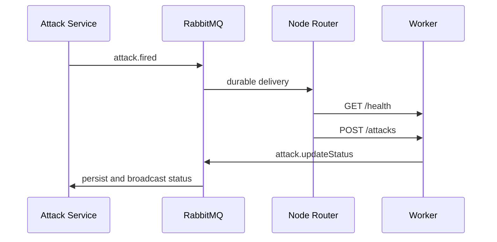

# LoadService Attack Node Router

The Attack Node Router is a Go RabbitMQ consumer between the NestJS Attack service and distributed worker nodes. It receives benchmark and cancellation events, selects an eligible worker by live health data, and forwards the job over HTTP.

## Project Map

| File | Responsibility |
|---|---|
| `main.go` | RabbitMQ consumption, health checks, worker selection, dispatch, cancel forwarding, and failure events |
| `.env.example` | RabbitMQ queue and worker connection settings |
| `Dockerfile` | Static Linux binary in a non-root Alpine image |

## Main Features

- Declares and consumes a durable attack queue with manual acknowledgements.
- Understands NestJS event envelopes for `attack.fired` and `attack.cancel`.
- Checks all plan-allowed workers concurrently with a two-second HTTP timeout.
- Rejects unhealthy nodes and nodes whose active count has reached their configured slots.
- Selects the healthy node with the smallest active-job count.
- Dispatches the complete event payload to `POST /attacks`.
- Keeps an in-memory attack-to-node assignment for later cancellation.
- Publishes `attack.updateStatus` with `FAILED` when dispatch cannot complete.

## Event And HTTP Flow



Cancellation uses `attack.cancel`; the router looks up the assigned worker and sends `POST /attacks/{id}/stop`.

## Prerequisites

- Go `1.26.5` or a compatible newer release.
- RabbitMQ reachable from the router.
- One or more worker addresses supplied by `attack.fired` events.
- Worker HTTP ports reachable from the router host or container.

## Configuration

```bash
cp .env.example .env
```

| Variable | Purpose |
|---|---|
| `RABBITMQ_URL` | AMQP connection string |
| `RABBITMQ_ATTACK_QUEUE` | Input queue carrying `attack.fired` and `attack.cancel` |
| `RABBITMQ_ATTACK_STATUS_QUEUE` | Output queue carrying `attack.updateStatus` |
| `ATTACK_NODE_PROTOCOL` | Worker URL scheme, normally `http` |
| `ATTACK_NODE_PORT` | Port shared by all worker URLs built by the router |

`ATTACK_NODE_PORT` must equal each worker's `LISTEN_PORT`. The example values in the two component `.env.example` files currently differ, so align them before starting the flow.

## Run

```bash
go mod download
go run .
```

The router has no HTTP listener. A successful start logs the RabbitMQ attack queue it is consuming.

## Dispatch Rules

1. Read `allowedServers` from the event; each entry supplies database ID, address, and maximum slots.
2. Build `ATTACK_NODE_PROTOCOL://<address>:ATTACK_NODE_PORT`.
3. Call `/health` concurrently and ignore invalid, unavailable, or full nodes.
4. Sort the remaining nodes by `active` count and select the least busy.
5. Add the selected `serverId`, remember the assignment in memory, and post to `/attacks`.
6. Ack the RabbitMQ delivery whether dispatch succeeds or a failure status has been published.

CPU and memory are logged but are not currently used in selection.

## Docker

```bash
docker build -t loadservice-attack-node-router .
docker run --rm --env-file .env loadservice-attack-node-router
```

The repository-level `docker-compose.go.yml` can run the published router image. Ensure the container can reach RabbitMQ and worker addresses.

## Useful Checks

```bash
gofmt -w main.go
go test ./...
go vet ./...
go build ./...
```

## Troubleshooting

- Startup cannot read `.env`: the file is required in the current working directory.
- RabbitMQ connection fails: verify credentials, virtual host, port, and container network routing.
- `No healthy attack nodes`: check addresses from the Attack database and call each worker's `/health` from the router host.
- `System is overloaded`: every reachable worker reported `active >= slots`.
- Worker receives no request: make sure the router's port matches the worker and that host firewalls allow it.
- Cancellation does nothing after restart: assignments are in memory and are lost when the router restarts.
- Status events are missing: verify `RABBITMQ_ATTACK_STATUS_QUEUE` matches the backend and worker configuration.

## Notes For Development

- Malformed or unsupported RabbitMQ envelopes are negatively acknowledged without requeue.
- Dispatch failures are acknowledged after publishing a terminal failure, so the router does not retry automatically.
- Worker selection is per message; the backend Redis reservation and worker-reported `active` count provide separate capacity signals.
- Protect all worker addresses and RabbitMQ credentials; this component assumes a trusted internal network.
