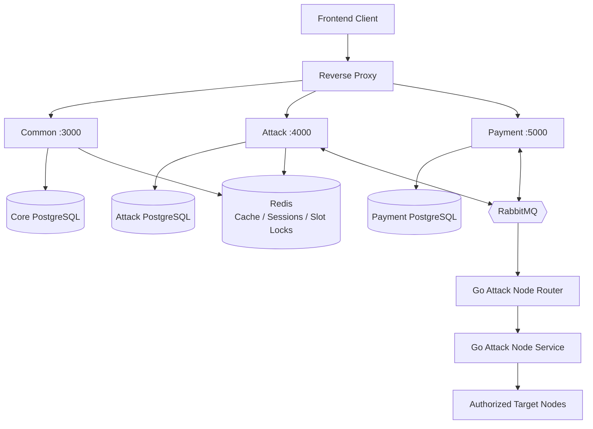
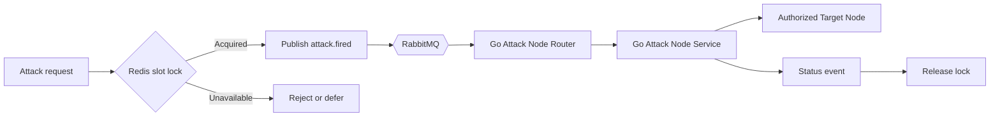

# LoadService Backend

> A production-minded, event-driven backend for managing authorized load-testing infrastructure, subscriptions, payments, and real-time operations.

LoadService is built to make distributed load-testing workflows easier to operate safely. It provides a unified API for identity and access management, plans and feature entitlements, attack orchestration, target-node management, payment processing, and live status updates.

The backend is organized as a modular NestJS monorepo with independently runnable services. This separation keeps business domains isolated while allowing them to communicate asynchronously through durable RabbitMQ events.

## Why this project stands out

- **Domain-oriented service boundaries**: core platform capabilities, attack orchestration, and payment processing run as separate applications.
- **Event-driven communication**: RabbitMQ decouples long-running attack and payment workflows from synchronous API requests.
- **Real-time operational visibility**: Socket.IO gateways stream attack, payment, and support-ticket updates to connected clients.
- **Secure identity and authorization**: JWT access/refresh tokens, Google OAuth, Argon2 password hashing, role-based access control, and permission management.
- **Reliable data design**: PostgreSQL databases are separated by service and modeled with type-safe Drizzle ORM schemas.
- **Operational tooling included**: database migration, reset, and seed scripts; environment-based configuration; Docker deployment; Swagger API documentation.

## Architecture





```text
                         ┌──────────────────┐
                         │  Frontend Client │
                         └────────┬─────────┘
                                  │ REST / WebSocket
                                  ▼
                         ┌──────────────────┐
                         │  Reverse Proxy  │
                         │  Routing / TLS  │
                         └────────┬─────────┘
                                  │
        ┌─────────────────────────┼─────────────────────────┐
        ▼                         ▼                         ▼
 ┌──────────────┐          ┌──────────────┐          ┌──────────────┐
 │ Common :3000 │          │ Attack :4000 │          │ Payment:5000 │
 └──────┬───────┘          └──────┬───────┘          └──────┬───────┘
        └───────────────┬─────────┴─────────┬───────────────┘
                        ▼                   ▼
                  ┌──────────┐       ┌──────────────────────┐
                  │ RabbitMQ │       │ Redis                │
                  └────┬─────┘       │ Cache / sessions /   │
                       │ attack events│ distributed slot lock│
                       │              └──────────────────────┘
                       ▼
              ┌──────────────────────┐
              │ Go Attack Node Router│
              └──────────┬───────────┘
                         ▼
              ┌──────────────────────┐
              │ Go Attack Node Service│
              └──────────┬───────────┘
                         ▼
                 Authorized target nodes

             ┌──────────┴──────────┐
             ▼                     ▼
       PostgreSQL: core      PostgreSQL: attack/payment
```

### Attack dispatch flow

```text
Client → Attack Service → validates request and entitlement
                       → persists attack record
                       → publishes attack.fired to RabbitMQ
                                      │
                                      ▼
                            Go Attack Node Router
                                      │ HTTP
                                      ▼
                            Go Attack Node Service
                                      │
                                      ▼
                            Authorized target node
```

### Distributed slot locking

```text
Attack request → Redis atomic slot lock → reserve available capacity
                         │                         │
                         └─ unavailable ───────────┴─ reject / defer

Attack completion, failure, or cancellation → release the lock
```

Redis acts as the shared concurrency boundary across service instances, preventing duplicate claims against the same worker slot.

### Payment flow

```text
Client → Payment Service → create payment and QR details
                         → persist payment in PostgreSQL

SePay webhook → signature verification → update payment status
                                          ├─ publish payment event
                                          └─ emit real-time Socket.IO update
```

### Services

| Service | Port | Responsibility |
| --- | ---: | --- |
| `common` | `3000` | Authentication, users, roles, permissions, plans, features, news, and support tickets |
| `attack` | `4000` | Attack lifecycle, methods, networks, target servers, entitlements, and attack status events |
| `payment` | `5000` | Payment records, SePay webhook handling, payment events, and real-time payment updates |

All REST endpoints use the `/api/v1` prefix. Swagger is available at `/api-docs` for each service.

## Technology stack

- **Runtime and language:** Node.js 24+, TypeScript 5.7+
- **Framework:** NestJS 11, Express, RxJS
- **Data:** PostgreSQL, Drizzle ORM, Drizzle Kit
- **Messaging:** RabbitMQ, NestJS Microservices, AMQP
- **Caching, sessions, and concurrency control:** Redis via `ioredis`, including distributed slot locking
- **Authentication:** JWT, Passport, Google OAuth, Argon2
- **Realtime:** Socket.IO and NestJS WebSockets
- **Validation and API contracts:** `class-validator`, `class-transformer`, Swagger / OpenAPI
- **Tooling:** pnpm, ESLint, Prettier, Jest, Docker Compose

## Prerequisites

- Node.js `>= 24`
- pnpm
- PostgreSQL, Redis, and RabbitMQ
- Google OAuth and SMTP credentials for the complete authentication flow
- SePay credentials if payment webhooks are enabled

## Local setup

```bash
pnpm install
cp .env.example .env
```

Update `.env` with local PostgreSQL, Redis, RabbitMQ, JWT, OAuth, SMTP, and payment values. Never commit `.env` or production secrets.

Create the three configured PostgreSQL databases:

```text
core_service_db
attack_service_db
payment_service_db
```

Apply schemas and seed development data:

```bash
pnpm db:migrate
pnpm db:migrate:attack
pnpm db:migrate:payment
pnpm db:seeder:core
pnpm db:seeder:attack
```

To rebuild development databases from scratch:

```bash
pnpm db:reset
```

## Running the services

Run each service in a separate terminal:

```bash
pnpm dev:common
pnpm dev:attack
pnpm dev:payment
```

```text
Common API:  http://localhost:3000/api/v1
Attack API:  http://localhost:4000/api/v1
Payment API: http://localhost:5000/api/v1
Swagger:     http://localhost:<port>/api-docs
```

## Docker workflows

The default Compose file builds all three services from the current source tree. This is useful for local integration testing and self-hosted environments:

```bash
docker compose up --build -d
```

To rebuild after source or dependency changes:

```bash
docker compose build --no-cache
docker compose up -d
```

The production Compose file pulls the published images from Docker Hub and always checks for the latest image:

```bash
docker compose -f docker-compose.prod.yml pull
docker compose -f docker-compose.prod.yml up -d
```

Both Compose files expose the same services, ports, environment file, and restart policy. The only difference is the image source: `docker-compose.yml` builds from source, while `docker-compose.prod.yml` pulls from Docker Hub.

Build and validate the application locally before packaging:

```bash
pnpm build
pnpm lint
pnpm test
```

## Key scripts

| Command | Purpose |
| --- | --- |
| `pnpm build` | Compile all NestJS applications |
| `pnpm lint` | Fix lint issues across the codebase |
| `pnpm test` | Run unit tests |
| `pnpm test:cov` | Generate a coverage report |
| `pnpm db:migrate*` | Apply core, attack, or payment schemas |
| `pnpm db:seeder*` | Seed development data |
| `pnpm db:reset` | Drop, migrate, and seed all databases |

## Security notes

Load-testing functionality must only be used against systems you own or are explicitly authorized to test. Keep attack-node credentials and signing secrets private, use strong randomly generated JWT secrets, validate webhook signatures, and restrict CORS origins in production.

## Engineering practices

The codebase follows NestJS module boundaries, DTO-based input validation, repository/service separation, typed database schemas, environment-driven configuration, durable messaging, and automated formatting, linting, and testing. These conventions make new domains easier to add without coupling unrelated services.

## License

This project is private and currently distributed under an unlicensed internal-use model.
