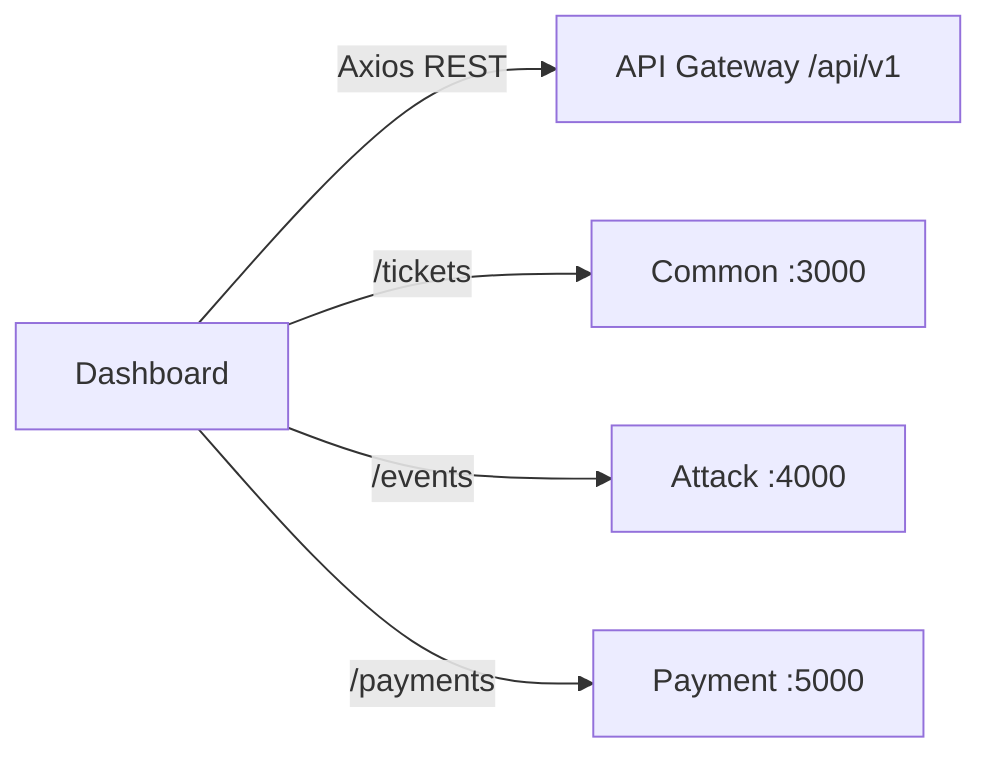

# LoadService Dashboard

The LoadService dashboard is a React and Vite single-page application for user self-service and platform administration. REST requests go through the Go API gateway, while attack, ticket, and payment updates connect directly to backend Socket.IO namespaces.

## Project Map

| Path | Responsibility |
|---|---|
| `src/routes` | TanStack Router file-based routes and access layouts |
| `src/features` | Page-level user, admin, auth, dashboard, payment, ticket, and settings features |
| `src/services` | Typed API clients and Socket.IO client factories |
| `src/components` | Shared layout, data-table, form, dialog, and UI primitives |
| `src/store` | Zustand authentication state and token cookies |
| `src/hooks` | Reusable table, dialog, mobile, and realtime hooks |
| `src/constants` | Route, endpoint, query-key, and environment configuration |
| `src/providers` | Theme, layout, direction, search, and font providers |
| `src/styles` | Tailwind theme and global styles |
| `public` | Static icons and images |

`src/routeTree.gen.ts` is generated by the TanStack Router plugin and should not be edited manually.

## Main Features

- Registration, username/email login, Google OAuth callback, email verification, and password reset.
- Access/refresh token persistence, automatic API authorization, profile updates, and session management.
- Dashboard statistics and a 30-day benchmark activity chart.
- Plans, QR payments, payment history, and realtime payment status.
- Benchmark hub, history, cancellation, live attack status, and server monitoring.
- News and support tickets with realtime conversation updates.
- Administrator screens for users, roles, permissions, plans, features, networks, servers, methods, attacks, news, and tickets.
- Responsive sidebar, themes, font/layout preferences, tables, filters, dialogs, and toast notifications.

Some inherited template routes (`tasks`, `apps`, `chats`, Clerk examples, and error pages) remain in the source but are not part of the primary LoadService navigation.

## Technology Stack

- React 19 and TypeScript 6.
- Vite 8 and TanStack Router with generated file routes.
- TanStack Query and TanStack Table.
- Tailwind CSS 4, Radix UI, and shadcn-style components.
- Axios, Zustand, React Hook Form, and Zod.
- Socket.IO Client and Recharts.
- Vitest browser mode with Playwright Chromium.

## Prerequisites

- Node.js `>=24`.
- pnpm.
- LoadService gateway for REST traffic.
- Common, Attack, and Payment backends for Socket.IO and complete feature flows.

## Configuration

```bash
cp .env.example .env
```

| Variable | Purpose |
|---|---|
| `VITE_API_URL` | REST base URL, normally `http://localhost:8080/api/v1` |
| `VITE_COMMON_SOCKET_URL` | Common backend origin; the client uses namespace `/tickets` |
| `VITE_ATTACK_SOCKET_URL` | Attack backend origin; the client uses namespace `/events` |
| `VITE_PAYMENT_SOCKET_URL` | Payment backend origin; the payment page uses namespace `/payments` |
| `VITE_ALLOWED_HOSTS` | Comma-separated hostnames accepted by the Vite development server |

Vite variables are embedded at build time. Rebuild the Docker image after changing production URLs.

## Run Frontend

```bash
corepack enable
pnpm install
pnpm dev
```

The development server binds to `0.0.0.0`; open `http://localhost:5173` unless Vite selects another available port.

Build and preview the production bundle:

```bash
pnpm build
pnpm preview
```

## Main User Flow

1. Register or sign in; the auth store keeps access and refresh tokens in cookies.
2. Axios sends bearer credentials to the configured gateway and attempts token refresh on an expired session.
3. Choose a plan and create a payment to receive QR details; the payment page joins its Socket.IO room for status changes.
4. Open the benchmark hub, select a method and options, and submit an authorized target.
5. The attack socket invalidates cached hub data and shows status toasts as the backend publishes updates.
6. View server health, news, account sessions, or create a support ticket.

Administrators use the `/admin/*` routes. The admin layout verifies that the current user has the `ADMINISTRATOR` role.

## Backend Connections



The Go gateway does not proxy Socket.IO. All socket origins must be browser-reachable and allowed by backend CORS.

## Docker

The multi-stage Dockerfile builds the Vite bundle with Node 24 and serves it from Nginx:

```bash
docker build \
  --build-arg VITE_API_URL=http://localhost:8080/api/v1 \
  --build-arg VITE_COMMON_SOCKET_URL=http://localhost:3000 \
  --build-arg VITE_ATTACK_SOCKET_URL=http://localhost:4000 \
  --build-arg VITE_PAYMENT_SOCKET_URL=http://localhost:5000 \
  -t loadservice-dashboard .

docker run --rm -p 5173:80 loadservice-dashboard
```

`netlify.toml` also redirects all paths to `index.html` for client-side routing.

## Useful Checks

```bash
pnpm build
pnpm lint
pnpm format:check
pnpm test
pnpm knip
```

Install the test browser if Chromium is missing:

```bash
pnpm test:browser:install
```

## Troubleshooting

- REST requests fail: verify `VITE_API_URL` includes `/api/v1` and the gateway module map points to reachable backends.
- Realtime requests fail: verify direct socket origins and backend `CORS_ORIGIN`; do not point socket variables at `/api/v1`.
- Deep links return 404 in production: configure the host to fall back to `index.html`; Netlify configuration is included.
- Vite rejects a hostname: add only the hostname, without scheme or port, to `VITE_ALLOWED_HOSTS`.
- Browser tests fail to start: install Playwright Chromium with `pnpm test:browser:install`.
- Environment changes have no effect after deployment: rebuild the frontend because `VITE_*` variables are compile-time values.

## Notes For Development

- Use the shared Axios client in `src/lib/axios.ts` so authentication and response handling remain consistent.
- Add backend paths to `src/constants/endpoints.ts` and service modules instead of scattering request URLs across components.
- Keep generated route-tree changes paired with route-file changes.
- Tokens are currently stored in JavaScript-readable cookies; review the threat model before production deployment.
